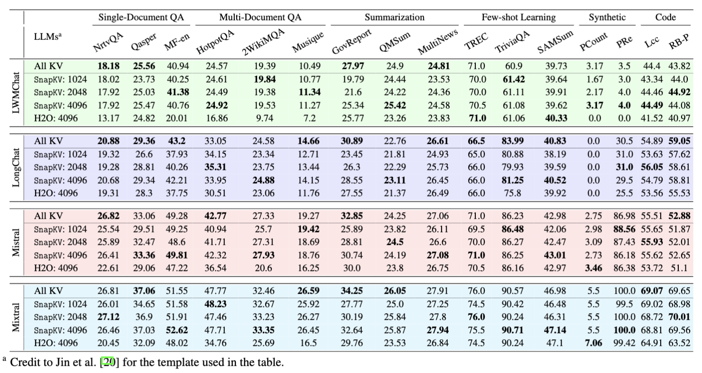

# SnapKV :camera:
We introduce an innovative and out-of-box KV cache compression method, [SnapKV](https://arxiv.org/abs/2404.14469).
## Requirements
Currently tested with `transformers==4.37.0`, need to check if it is compatible with higher version.
```
transformers>=4.36
flash-attn==2.4.0
```
## Installation
```
git clone git@github.com:FasterDecoding/SnapKV.git
cd SnapKV
pip install -e .
```
## Quick Start
### Use SnapKV-optimized Models
For example: 
```python
from snapkv.monkeypatch.monkeypatch import replace_mistral
replace_mistral() # Use monkey patches enable SnapKV
```

Check [the example notebook](./notebooks/example.ipynb).

### Customize Your SnapKV-optimized Models
SnapKV can be easily integrated with other models. 

You can follow the comment marked with `[SnapKV]` in [existing models](./snapkv/monkeypatch/monkeypatch.py) to construct your own models. (Currently we support [Llama family](./snapkv/monkeypatch/llama_hijack_4_37.py)/ [Mistral](./snapkv/monkeypatch//mistral_hijack_4_37.py)/ [Mixtral](./snapkv/monkeypatch//mixtral_hijack_4_37.py)) 

The detailed algorithm of SnapKV is in [`snapkv_utils.py`](./snapkv/monkeypatch/snapkv_utils.py)


## Partial Results



## TODO
- [ ] Add observation experiments for reduplication.
- [ ] Add LongBench for reduplication.
- [ ] Explore the prompt phase compression.

## Citation
If you feel this project is helpful, please consider cite our report :blush:
```
@article{li2024snapkv,
  title={SnapKV: LLM Knows What You are Looking for Before Generation},
  author={Li, Yuhong and Huang, Yingbing and Yang, Bowen and Venkitesh, Bharat and Locatelli, Acyr and Ye, Hanchen and Cai, Tianle and Lewis, Patrick and Chen, Deming},
  journal={arXiv preprint arXiv:2404.14469},
  year={2024}
}
```