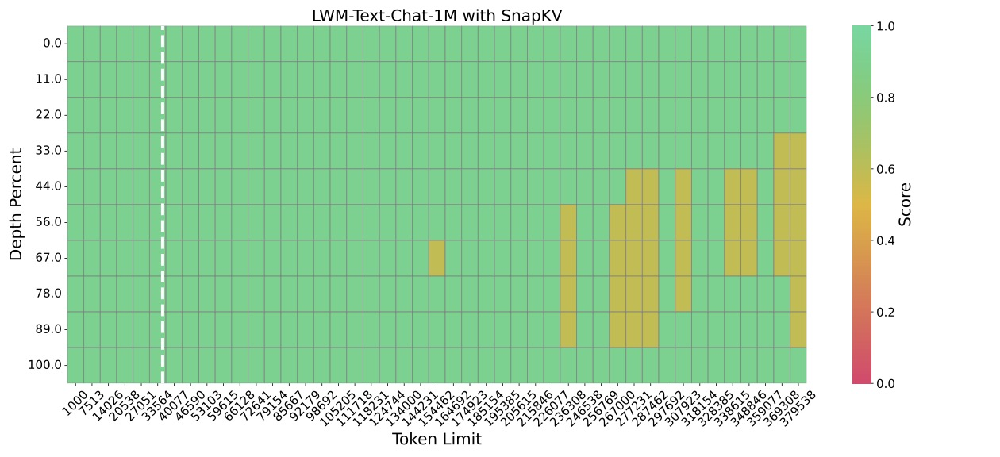

# SnapKV
We introduce an innovative and out-of-box KV cache compression method, SnapKV.

## Quick Start
### Use SnapKV-optimized Models
SnapKV-optimized models are all under models file, which could be directly imported and used the same like baseline models.
For example: 
```python
from models.modeling_mistral import MistralForCausalLM as SnapKVMistralForCausalLM
model = SnapKVMistralForCausalLM.from_pretrained(
    model_name,
    torch_dtype=torch.float16,
    low_cpu_mem_usage=True,
    device_map="auto",
    use_flash_attention_2=True
)
tokenizer = transformers.AutoTokenizer.from_pretrained(
    model_name,
    padding_side="right",
    use_fast=False,
)
```

### Customize Your SnapKV-optimized Models
SnapKV can be easily integrate with other models. You can follow the comment marked with `[SnapKV]` in [existing models](./models) to constrcut your own models. The detailed algorithm of SnapKV is in [snapkv_utils.py](./snapkv_utils.py)


## Results

